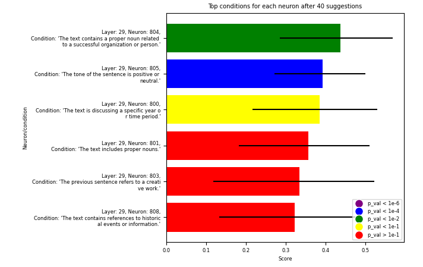
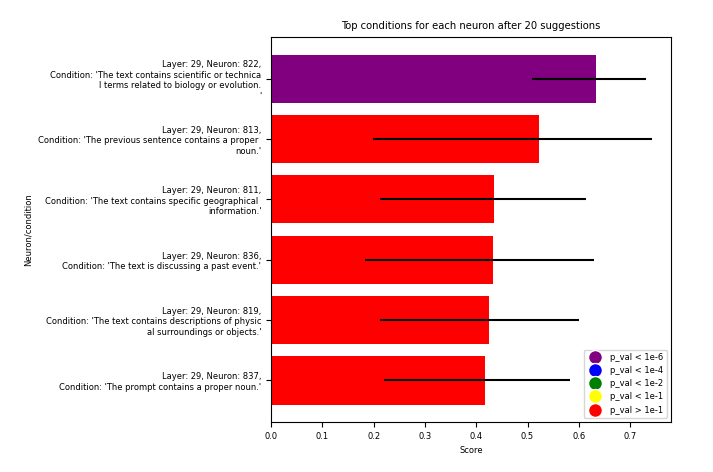
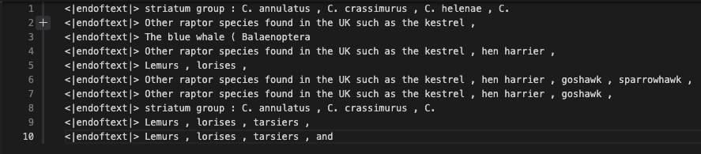
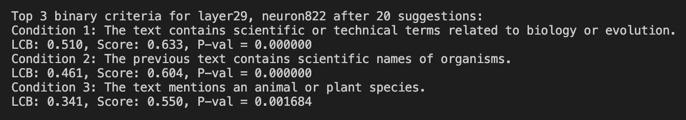
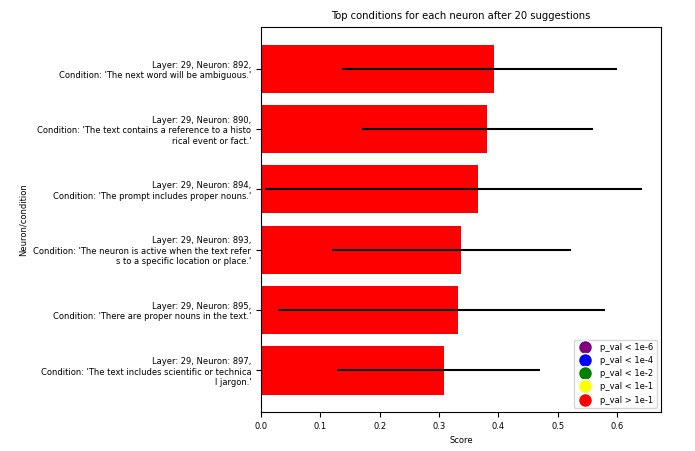

# AutoInterpret

**Hoagy Cunningham and Misha Wagner**

## Summary

*Work done during (and slightly before, sorry!) the [AI interpretability Hackathon 2.0](https://itch.io/jam/interpretability-hackathon?fbclid=IwAR0keVyeH0I5SO58ZDGeR4ePiRUAce7USlV0wL_7zdU9u52yXrfDpFM5R1E).*

In this project we used OpenAI's `gpt-3.5-turbo` model to build a system which autonomously proposes hypotheses for what a neuron in GPT2-large might 'mean', and evaluates them, repeating this process to find the best possible hypothesis. Our hypotheses are binary conditions over the recent context window of the transformer, and we evaluate the YES/NO answers of this condition by correlation with the neurons's activation.

We find that our current system is able to generate hypotheses for a reasonable fraction of neurons (perhaps 1 in 20) where the automatic evaluation of the binary condition of the text has a significant correlation with the neuron's activation, when correcting for the presence of many hypotheses.



Nonetheless the hypotheses generated are usually bland and not particularly informative. We hypothesize that this is because our current strategy of understanding neurons simply in terms of when they are on and off is too simplistic and and the next major step (along with many minor ones) should be to enable the system to suggest and evaluate richer forms of hypothesis about how a model is working.

## Our Work

Previous work has shown that LLMs are capable of finding unexpected connections, and doing labelling of models. We want to combine these capabilities into a single system, so that the system can take in various datapoints around an aspect of the models internals, propose a hypothesis for what this part of the model might mean.

Our system, which is able to automatically generate and evaluate hypotheses, runs the following procedure:

- For each neuron that we are looking at, at each turn we:
    - Get a new hypothesis for what the neuron might be doing, by:
        - Showing `gpt-3.5-turbo` examples of contexts causing high and negative activation
        - Showing examples of previous hypotheses that scored fairly well.
        - Asking for a hypothesis, in the form of a binary condition, for what the neuron might be doing, that would score even better.
    - Evaluate the new hypothesis by:
        - Showing `gpt-3.5-turbo` a context window which causes high activation, and assessing whether it does or does not meet the binary condition
        - Repeating this for a context window that causes low activation
        - Continue until we have 10 evaluations.
        - Calculate the correlation between the neurons activation, and the YES/NO answers, treated as 1/0s.
    - Get more information on our best hypotheses, by:
        - Finding the hypothesis that has the highest upper confidence bound for the score, and evaluate it several more times, 
        - Repeating this 3 times.
- Repeat as long as desired. 
- Report results ordered by the best score, while keeping track of p-values, performing a Bonferroni correction on the p-values of the correlation where the effective number of hypotheses under consideration is calculated by the total number of YES/NO questions asked across the entire population of neurons currently under consideration, divided number of trials done on this particular hypothesis.

When permanently running, the system consumes about 1.4M tokens in requests to the server by hour, at least on my laptop. `gpt-3.5-turbo` costs $1 per 500K tokens, so this system costs about $3 an hour, in which time it generates and evaluates a few hundred hypotheses. This could probably be made much more efficient, but part of the idea here is to probe what can be done if basic intellectual tasks can be treated as essentially free.

## Results

We display results in terms of showing the neurons which have the top scoring hypotheses across the set of neurons that we're considering, showing the p-value by the colour of the bar.

The longest experiment we've run so far is running the system on neurons 810-840 for 20 suggestions. This produced a single hypothesis with clear explanatory power - "The text contains scientific or technical terms related to biology or evolution.", for neuron 822 of layer 29, as seen below. 



For this neuron we can also see that the next best hypotheses were similar, and independently scored highly, and we can also see from taking the sentences with the highest activations that there is in fact a clear pattern.




For most neurons we don't find anything nearly as solid. For example, lookng at neurons 890-900 for 20 iterations, which includes the 'an' neuron mentioned below, we don't see any stand-out hypotheses.



These three graphs (including the one in the summary) form the vast majority of the experiments performed for this hackathon.
## Running the system

To run this system you will need quite a few GB of memory and RAM to download GPT-2-Large and run the activations. If you don't have access to a GPU or powerful computer, set `model_size="small"` in main.py and set `n_sentences` to something smaller if getting the activations is slow.

To run you will also need an OpenAI paid account key saved in `secrets.json` like so:

```
{
    "openai_key": "sk-YOUR-KEY-HERE",
}
```

Then run the following to get the system running. 
```
python -m venv .env 
pip install -r requirements.txt
python main.py
```
Edit the `l_rng` and `n_rng` variables in `main()` to change which neurons you are investigating.

## Trying to find the 'an' neuron

One of our goals for this system, and the main reason we used GPT2-large in particular, was that we hoped (and still do!) that this kind of system could in theory independently rediscover the main result in [We Found An Neuron in GPT-2](https://www.lesswrong.com/posts/cgqh99SHsCv3jJYDS/we-found-an-neuron-in-gpt-2), where they found a neuron that 

What we found was that we could replicate the results on contrived examples - neuron 892 of layer 29 was usually more active on sentences like `'A pear fell from a pear tree, a {fruit} fell from..'`, when the fruit in question began with a vowel. 

However, when we took contexts which led to high activations of that neuron, the pattern was barely noticeable, and would be impossible for either us or GPT-4 to see any connection.

We're still not sure if this is because we didn't use a large enough corpus to find examples where 'an' was highly likely, or because our method of getting sentences was confused or wrong somehow, but we think it highlights the difficultly of locating the meaning of a neuron from just the contexts in which it is active.

## Theoretical Description
The particular system here is a single, rather slow and weak example of a wider pattern of turning interpretability into a game, by automatically evaluating the extent to which a given hypothesis matching the data.

The basic pattern is the following:

- the model one wishes to understand (in this case GPT2-Large), $M$ 
- a set of inputs $i\in I$ which forms the domain on which we want to understand the model's behaviour
- some function of the models behaviour which we think represents some important component of understanding of the models behaviour (e.g. the activations of particular neurons, or directions in activation space) $f: (M, i) \rightarrow \mathbb{R}^n$
- a function (model) for evaluating whether a condition $C$ is met by input $i$, $g: (C, i)\rightarrow \mathbb{R}$ , (e.g. few-shot prompting gpt-3.5-turbo with "does text input {text} meet binary condition {bin_con}?")
- an agreement function $h: (f(M, i), g(C, i)) \rightarrow \mathbb{R}$ (e.g. the correlation between the responses (boolean interpreted as an int) and the activation float). 

This can be adapted to many different approaches to alignment, and I'd love to see people see what else could be done with it.

## Building on this work

We'd greatly welcome anyone who wants to collaborate or fork off from this project. 

The most important form of improvement is, I think, more sophisticated understanding of what it means to understand a model, looking at directions, including model patching. 

I think we're only scratching the surface of the kind of models, and in fact as the nature of 'evaluating a hypothesis about a model' becomes more involved and complex, the payoffs of automating that evaluation will only grow.

There are also more limited imporvements which are possible such as:

- Better suggestion generation, such as by:
    - Using stronger models
    - Fine-tuning the models, or using RL on the scores
    - Better prompting of the existing models, especially regarding variation in suggestions - it can be very repetitive.
    - Giving the model better information, including:
        - Showing the token that the model eventually predicted, or the true completion, or the activation throughout a sequence of tokens
        - Showing sentences that have high semantic similarity to cases where the activation is high, but where the activation is low.
- Better scoring, such as by:
    - Better understand of how to handle negative activations with the GELU function
    - Using a flexible binary threshold for neuron being 'on' instead of using correlation.

Basically, I hope that where there is theoretical progress about how we should understand what a model is doing, and the kind of tests that would confirm this, we are able to pull that progress into system like these, to multiply understanding cheaply across whole networks.

## Attribution

Core system built by Hoagy Cunningham. Work to test the system with the 'an' neuron from GPT-2-large, and many helpful suggestions and conversations from Misha Wagner.